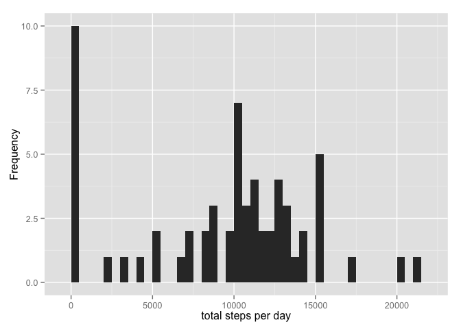
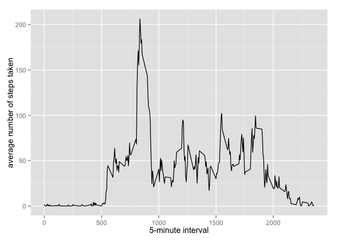
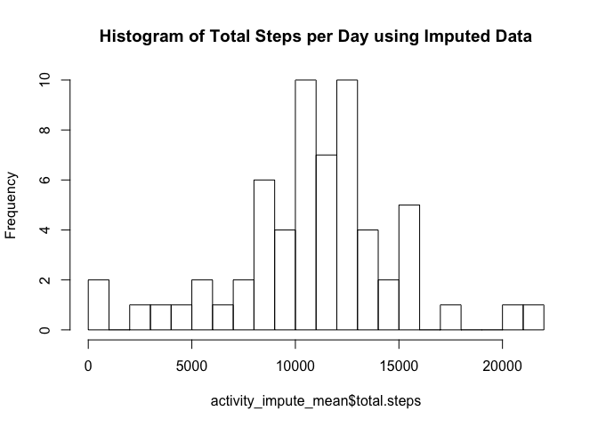
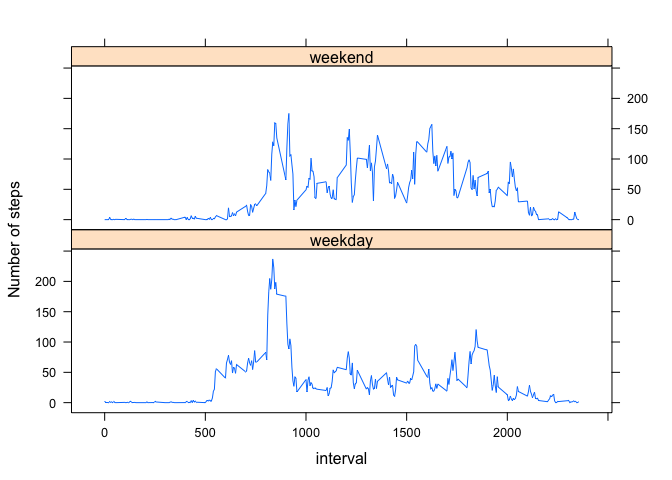

Title:This is my first R Markdown file for Reproducible research peer assessment 1
https://class.coursera.org/repdata-033/human_grading/view/courses/975146/assessments/3/submissions
output: 
---

This assignment makes use of data from a personal activity monitoring device. This device collects data at 5 minute intervals throughout the day. The data consists of two months of data from an anonymous individual collected during the months of October and November, 2012 and include the number of steps taken in 5 minute intervals each day.

The variables included in this dataset are:

Steps: Number of steps taking in a 5-minute interval (missing values are coded as NA)
Date: The date on which the measurement was taken in YYYY-MM-DD format
Interval: Identifier for the 5-minute interval in which measurement was taken

The dataset is stored in a comma-separated-value (CSV) file and there are a total of 17,568 observations in this dataset.


```r
setwd("/Users/lizard0827/Desktop/class/Reproducible research/")
library("dplyr") ## dplyr is used for structuring the data for analysis
```

```
## 
## Attaching package: 'dplyr'
## 
## The following object is masked from 'package:stats':
## 
##     filter
## 
## The following objects are masked from 'package:base':
## 
##     intersect, setdiff, setequal, union
```

```r
library("ggplot2")  ## ggplot2 is required for several plots
```

```
## Warning: package 'ggplot2' was built under R version 3.1.3
```

```r
library("lattice")  ## lattice plot is required for the weekday and weekend plot
```
Then read the activity data.

```r
activity<- read.csv("activity.csv")
activityData<- tbl_df(activity)
```
What is mean total number of steps taken per day?

```r
stepbyday<-tapply(activityData$steps,activityData$date, sum, na.rm=TRUE)
qplot(stepbyday, xlab='total steps per day', ylab='Frequency', binwidth=500)
```

 

1. Calculate and report the mean total number of steps taken per day
2. Calculate and report the mean and median of the total number of steps taken per day

```r
stepsbydaymean<- mean(stepbyday)
stepsbydaymedian<-median(stepbyday)
stepsbydaymean
```

```
## [1] 9354.23
```

```r
stepsbydaymedian
```

```
## [1] 10395
```
• mean: 935.43
• median: 10395

What is the average daily activity pattern?
1. Make a time series plot

```r
averagestepsdaily <- aggregate(x=list(meanSteps=activityData$steps), by=list(interval=activityData$interval), FUN=mean, na.rm=TRUE)
ggplot(data=averagestepsdaily, aes(x=interval, y=meanSteps))+
  geom_line()+
  xlab("5-minute interval") +
    ylab("average number of steps taken") 
```

 

2. Which 5-minute interval, on average across all the days in the dataset, contains the maximum number of steps?

```r
mostSteps<- which.max(averagestepsdaily$meanSteps)
print(averagestepsdaily[mostSteps,])
```

```
##     interval meanSteps
## 104      835  206.1698
```
•most steps at: 835

Imputing missing values
1. Calculate and report the total number of missing values in the dataset

```r
sum(is.na(activity$steps))
```

```
## [1] 2304
```
• total number of missing values: 2304
2. Create a new dataset that is equal to the original dataset but with the missing data filled in
3. Make a histogram of the total number of steps taken each day

```r
activityData$interval.factor <- as.factor(activityData$interval)
activityData$weekday<- weekdays(as.Date(activityData$date))
activityData<-activityData %>% mutate(daytype=ifelse(weekday=="Saturday" | weekday=="Sunday", "weekend", "weekday"))
activity_day<-activityData %>% group_by(weekday, interval.factor) %>% summarise(mean.steps = mean(steps, na.rm=TRUE))
```


```r
activity_impute <- merge(activityData, activity_day, by=c("weekday","interval.factor"))
activity_impute$impute.steps <- ifelse(is.na(activity_impute$steps), activity_impute$mean.steps, activity_impute$steps)
```


```r
activity_impute_mean <- activity_impute %>% group_by(date) %>% 
  summarise(total.steps = sum(impute.steps))
hist(activity_impute_mean$total.steps, breaks = 25, 
     main = "Histogram of Total Steps per Day using Imputed Data")
```

 

4. Calculate and report the mean and median of the total number of steps taken per day

```r
stepsbydaymean_imputed<- mean(activity_impute_mean$total.steps)
stepsbydaymedian_imputed<-median(activity_impute_mean$total.steps)
stepsbydaymean_imputed
```

```
## [1] 10821.21
```

```r
stepsbydaymedian_imputed
```

```
## [1] 11015
```
• mean: 10821.21
• median: 11015

Are there differences in activity patterns between weekdays and weekends?
1. Create a new factor variable in the dataset with two levels – “weekday” and “weekend” indicating whether a given date is a weekday or weekend day.

2. Make a panel plot containing a time series plot (i.e. type = "l") of the 5-minute interval (x-axis) and the average number of steps taken, averaged across all weekday days or weekend days (y-axis). See the README file in the GitHub repository to see an example of what this plot should look like using simulated data.


```r
activity_impute_mean<- activity_impute %>% group_by(interval, daytype) %>% summarise(mean.steps= mean(impute.steps))

head(activity_impute_mean)
```

```
## Source: local data frame [6 x 3]
## Groups: interval
## 
##   interval daytype mean.steps
## 1        0 weekday   2.310714
## 2        0 weekend   0.000000
## 3        5 weekday   0.450000
## 4        5 weekend   0.000000
## 5       10 weekday   0.175000
## 6       10 weekend   0.000000
```

```r
xyplot(mean.steps ~ interval|daytype, activity_impute_mean, type="l", lwd= 1, xlab="interval", ylab="Number of steps", layout=c(1,2))
```

 
